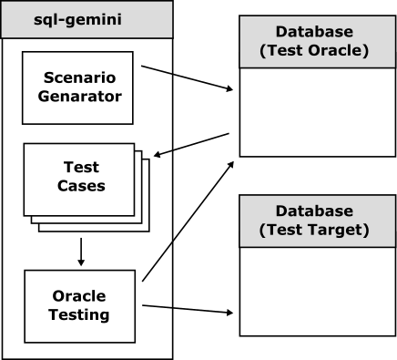

# sql-gemini

 

The `sql-gemini` is an Oracle testing tool for testing SQL-compatible RDBMSs and for checking functional compatibility by comparison testing two different SQL-compatible databases.

The `sql-gemini` was developed as a compatibility enhancement and verification tool for MySQL and PostgreSQL compatible PuzzleDB, inspired by ScyllaDB's [Gemini](https://www.scylladb.com/2019/12/11/project-gemini-an-open-source-automated-random-testing-suite-for-scylla-and-cassandra-clusters/) project.

## Features

The `sql-gemini` offers several key features to enhance database testing and validation:

- **Compatibility Verification**: Ensures functional compatibility across different SQL-compatible databases, allowing users to verify that their applications will work seamlessly regardless of the underlying database system.
- **Scenario Test Generation**: Automatically creates scenario tests to validate the behavior of databases under various conditions, helping to identify potential issues before they affect production environments.
- **Fuzzing Tests**: Utilizes random data to test the robustness and stability of databases, uncovering vulnerabilities and edge cases that might not be detected through traditional testing methods.
abases using random data.

## How It Works

The `sql-gemini` operates by executing the same queries on two different databases and comparing the results to determine if they are identical. This process, known as an Oracle test, helps ensure that both databases behave consistently under the same conditions. The steps involved in this process are:

1. **Query Generation**: `sql-gemini` generates a set of SQL queries designed to test various aspects of database functionality.
2. **Execution**: These queries are executed on both the target databases.
3. **Result Comparison**: The results from both databases are compared to check for any discrepancies.
4. **Reporting**: Any differences in the results are reported, highlighting potential compatibility issues.

By following these steps, `sql-gemini` helps users verify that their applications will function correctly across different SQL-compatible databases.
## References

- [Test oracle - Wikipedia](https://en.wikipedia.org/wiki/Test_oracle)
  - [Barr, Earl T., et al. "The oracle problem in software testing: A survey." IEEE transactions on software engineering 41.5 (2014): 507-525.](https://ieeexplore.ieee.org/abstract/document/6963470)
  - [Shahamiri, Seyed Reza, Wan Mohd Nasir Wan Kadir, and Siti Zaiton Mohd-Hashim. "A comparative study on automated software test oracle methods." 2009 fourth international conference on software engineering advances. IEEE, 2009](https://ieeexplore.ieee.org/abstract/document/5298471/)
- [Project Gemini: An Open Source Automated Random Testing Suite for ScyllaDB and Cassandra Clusters - ScyllaDB](https://www.scylladb.com/2019/12/11/project-gemini-an-open-source-automated-random-testing-suite-for-scylla-and-cassandra-clusters/)